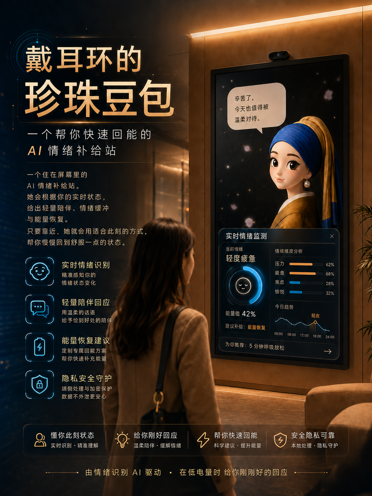

# 戴耳环的珍珠豆包

### 一个帮你快速回能的 AI 情绪补给站



一个住在屏幕里的 AI 情绪补给站。她会根据你的实时状态，给出轻量陪伴、情绪缓冲与能量恢复。只要靠近，她就会用适合此刻的方式，帮你慢慢回到舒服一点的状态。

> 由情绪识别 AI 驱动 · 在低电量时，给你刚刚好的回应

## 产品能力

- **实时情绪识别**：感知面部表情变化，判断此刻的情绪状态。
- **轻量陪伴回应**：用温和、不打扰的方式给出恰到好处的反馈。
- **情绪缓冲与回能**：通过数字人动画和回应，帮助用户从紧绷状态慢慢松下来。
- **隐私安全守护**：核心识别在浏览器本地完成，不上传摄像头画面，不保存人脸图像，也不需要注册账号。

本项目是轻量情绪互动体验，不提供医疗诊断，也不能替代专业心理咨询。

## 在线体验

- **立即体验（妙搭）**：<https://app-cioqmlo2afpd.appmiaoda.com>
- **GitHub Pages 镜像**：<https://bellanie.github.io/karen-emotion-avatar/>
- **下载完整源码 ZIP**：<https://github.com/BellaNie/karen-emotion-avatar/archive/refs/heads/main.zip>

新版妙搭 React 源码位于 [`miaoda-web/`](./miaoda-web/)。

## 下载体验

1. 点击 GitHub 页面右上方的 **Code → Download ZIP**。
2. 解压下载的 ZIP。
3. 安装 [Node.js 22](https://nodejs.org/)。
4. macOS 双击 `启动Karen-macOS.command`；Windows 双击 `启动Karen-Windows.bat`。
5. 浏览器打开 <http://127.0.0.1:5174/> 后，允许摄像头权限。

更完整的安装步骤和故障排查请看 [本地运行说明.md](./本地运行说明.md)。

## 无摄像头演示

即使不授予摄像头权限，也可以按键盘数字键测试动画：

| 按键 | 情绪 |
| --- | --- |
| `1` | neutral |
| `2` | happy |
| `3` | sad |
| `4` | angry |
| `5` | fearful |
| `6` | disgusted |
| `7` | surprised |

调试模式：<http://127.0.0.1:5174/?debug=true>

## 技术栈

- 新版网页：Vite + React + TypeScript
- 原版网页：Vite + Vanilla JavaScript
- face-api.js
- 本地 Tiny Face Detector 与表情识别模型
- 本地 MP4 数字人动画

## 项目结构

```text
miaoda-web/             # 妙搭导出的新版 React 网页
emotion-avatar-demo/
├── public/
│   ├── avatar/       # 数字人动画
│   ├── models/       # 本地表情识别模型
│   └── vendor/       # 本地 face-api.js
└── src/              # 情绪识别与动画状态机
```

根目录还包含 Duix H5 数字人会话实验。该部分需要开发者自行配置 Duix 账号；普通体验者只需运行 `emotion-avatar-demo`。

## 使用提示

- 推荐 Chrome 或 Edge。
- 摄像头功能需要通过 `localhost`/`127.0.0.1` 打开，不能直接双击 HTML 文件。
- 当前 `angry`、`fearful`、`disgusted` 没有专属动画，会使用等待动画作为保底。
- 本仓库未附开源许可证；除下载和本地体验外，其他使用请先联系项目所有者。
